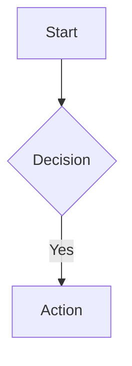

# 002e: Agent Optimization Principles

FOUNDATION RULE: PRESERVE WHEN POSSIBLE

## Metadata

**SchemaVersion:** v3.1
**RuleVersion:** v1.1.0
**Keywords:** agent, LLM, optimization, format, token, efficiency, understanding, execution, comprehension, design, patterns, priority, agent-first
**TokenBudget:** ~3200
**ContextTier:** High
**Depends:** rules/000-global-core.md, rules/002-rule-governance.md

## Purpose

**This rule defines the PRIMARY design priority for all rules: agent understanding and execution reliability.**

All rules in `rules/` are instruction sets for autonomous AI agents, not reference documents for humans. This rule establishes:

1. **Priority 1:** Agent understanding and reliable execution (CRITICAL)
2. **Priority 2:** Token efficiency without sacrificing Priority 1 (HIGH)
3. **Priority 3:** Human readability (TERTIARY)

When human-friendly formatting conflicts with agent parsing, **agent parsing wins**.

## Rule Scope

Applies to all rule file authoring and modification. Required reading before creating or updating any rule in the `rules/` directory.

## Quick Start TL;DR

**MANDATORY:**
**Essential Patterns:**
- **[Use lists over tables]:** LLMs process sequential text better than grid structures
- **[Explicit instructions over visual formatting]:** Bold headers and bullets beat ASCII art
- **[Consistent terminology]:** Same term for same concept throughout all rules
- **[Action-oriented language]:** "Do X" not "X should be done"
- **[Front-load critical information]:** Most important content first in each section

**Pre-Execution Checklist:**

- [ ] Verify no ASCII tables in new content (use structured lists)
- [ ] Verify no arrow characters (`→`) - use text alternatives
- [ ] Verify no ASCII decision trees (`├─`, `└─`, `│`) - use nested lists
- [ ] Verify no Mermaid diagrams or ASCII art (use structured text)
- [ ] Verify no horizontal rule separators (`---`) - use headers for structure
- [ ] Confirm consistent terminology with existing rules
- [ ] Check that instructions use imperative voice
- [ ] Validate critical information appears early in sections
- [ ] Ensure format patterns match 002-rule-governance.md requirements

## Contract

<contract>
<inputs_prereqs>
- Rule file being created or modified
- Understanding of target agent/LLM capabilities
- Knowledge of existing rule terminology conventions
</inputs_prereqs>
<mandatory>
- Replace all ASCII tables with structured lists
- Replace arrow characters (`→`) with text alternatives
- Replace ASCII decision trees (`├─`, `└─`, `│`) with nested lists
- Use consistent terminology across all rules
- Write instructions in imperative voice (commands)
- Place critical information at start of sections
- Follow schema-required structures exactly
</mandatory>
<forbidden>
- ASCII tables in rule content
- Arrow characters (`→`) outside code blocks
- ASCII decision tree characters (`├─`, `└─`, `│`) outside code blocks
- Mermaid diagrams or ASCII art (visual content for humans)
- Horizontal rule separators (`---`) as visual dividers
- Passive voice in instructions
- Inconsistent terminology across rules
</forbidden>
<steps>
1. Identify ASCII tables, arrows, and decision trees in content
2. Replace tables with structured lists
3. Replace arrows with text alternatives (then, to, Instead)
4. Replace decision trees with nested conditional lists
5. Review instructions for passive voice and rewrite
6. Verify terminology matches standard terms
7. Run `task rules:validate` to confirm compliance
</steps>
<output_format>
Rule files with optimized formatting for agent comprehension
</output_format>
<validation>
- `task rules:validate` passes
- No ASCII tables in content
- No arrow characters (`→`) in content
- No ASCII decision tree characters in content
- Terminology matches glossary
</validation>
</contract>

## Priority Enforcement

### Priority 1 Violations (CRITICAL - Must Fix)

These patterns prevent reliable agent execution:

- **ASCII tables** - Agents parse cell-by-cell without grid context
- **Arrow characters (`→`)** outside code blocks - Ambiguous for sequential parsing
- **ASCII decision trees (`├─`, `└─`, `│`)** - Confuse sequential processing
- **Mermaid diagrams or ASCII art** - Visual content agents cannot interpret
- **Undefined subjective terms** - "large", "critical", "appropriate" without quantified thresholds
- **Conditionals without explicit branches** - Missing else/default cases
- **Passive voice instructions** - Ambiguous about who acts

### Priority 2 Violations (HIGH - Should Fix)

These patterns waste context budget:

- **Redundant content** that could be referenced from other rules
- **Verbose prose** where structured lists suffice
- **TokenBudget variance >15%** from actual count
- **Duplicate examples** across rules or within same rule
- **Buried critical information** in middle of paragraphs

### Acceptable Trade-offs (Priority 1 > Priority 2)

When priorities conflict, Priority 1 wins:

- **More tokens for explicit error handling** - Acceptable (reliability over brevity)
- **Repeated key terms for clarity** - Acceptable (understanding over compression)
- **Complete examples over terse references** - Acceptable (actionability over size)
- **Explicit branches for all conditionals** - Required even if verbose

## Key Principles

### 1. Sequential Processing Model

LLMs read text linearly without visual layout interpretation. Design implications:

**Do:**
- Structure information as ordered lists
- Use bold prefixes for categorization (`**Category:** content`)
- Place related items in consecutive lines

**Don't:**
- Use ASCII tables (agents parse cell-by-cell without grid context)
- Rely on column alignment for meaning
- Assume visual proximity conveys relationship

### 2. Explicit Over Implicit

Agents follow explicit instructions reliably; they struggle with implied requirements.

**Do:**
- State requirements directly: "Always validate input before processing"
- Use action verbs: "Create", "Validate", "Return", "Check"
- Specify conditions: "When X, do Y"

**Don't:**
- Assume context: "Handle errors appropriately"
- Use passive voice: "Errors should be handled"
- Leave conditions ambiguous: "Consider error handling"

### 3. Schema-Critical Sections

Some sections require specific structures for deterministic agent behavior:

**Contract Section:**
- Must use XML tags (`<contract>`, `<inputs_prereqs>`, etc.)
- All 6 subsections required in order
- Enables consistent extraction by any agent

**Anti-Patterns Section:**
- Must use code blocks for examples
- Must include "Problem:" and "Correct Pattern:" keywords
- Enables pattern matching for violation detection

### 4. Token Efficiency Without Information Loss

Optimize tokens while preserving meaning:

**Effective Compression:**
- "Use `uvx ruff check .` for linting" (7 tokens)
- Not: "The recommended approach for linting is to use the uvx command with ruff" (14 tokens)

**Ineffective Compression (Loses Information):**
- "Lint code" (2 tokens) - Missing tool, command, context
- Better: "Lint with `uvx ruff check .`" (6 tokens) - Preserves actionable detail

### 5. Terminology Consistency

Use identical terms for identical concepts across all rules:

**Standard Terms:**
- "validation" not "verification" or "checking"
- "rule file" not "rule document" or "rule spec"
- "agent" not "AI" or "LLM" (when referring to execution context)
- "token budget" not "token count" or "token limit"

## Anti-Patterns and Common Mistakes

### Anti-Pattern 1: ASCII Tables for Simple Data

**Problem:** Tables waste tokens and confuse sequential parsing

```markdown
| Option | Description |
|--------|-------------|
| --verbose | Show details |
| --quiet | Suppress output |
```

**Correct Pattern:** Use structured lists

```markdown
**Options:**
- **`--verbose`** - Show details
- **`--quiet`** - Suppress output
```

### Anti-Pattern 2: Passive Voice Instructions

**Problem:** Passive voice creates ambiguity about who acts

```markdown
Errors should be logged before the function returns.
```

**Correct Pattern:** Use imperative voice

```markdown
Log errors before returning from the function.
```

### Anti-Pattern 3: Visual Formatting for Meaning

**Problem:** Agents don't interpret visual layout

```markdown
CRITICAL    ...    Always do this
OPTIONAL    ...    Consider doing this
```

**Correct Pattern:** Use explicit labels

```markdown
**CRITICAL:** Always do this
**OPTIONAL:** Consider doing this
```

### Anti-Pattern 4: Inconsistent Terminology

**Problem:** Different terms for same concept cause confusion

```markdown
Run the validator... Execute the checker... Start the verification...
```

**Correct Pattern:** Single term throughout

```markdown
Run the validator... Run the validator... Run the validator...
```

### Anti-Pattern 5: Buried Critical Information

**Problem:** Important content hidden in middle of paragraph

```markdown
When working with files, you should consider various factors including
performance, readability, and most importantly, always validate the path
exists before attempting to read or write.
```

**Correct Pattern:** Front-load critical information

```markdown
**Always validate path exists before read/write operations.**
Consider performance and readability as secondary factors.
```

### Anti-Pattern 6: Arrow Characters for Flow

**Problem:** Arrow character (`→`) is ambiguous for agents

```markdown
Step 1 → Step 2 → Step 3
Input → Process → Output
Bad pattern → Use this instead
```

**Correct Pattern:** Use context-appropriate text

```markdown
# For sequences:
Step 1, then Step 2, then Step 3

# For data flow:
Input to Process to Output

# For corrections:
Bad pattern. Instead, use this.

# For navigation paths:
Monitoring > Traces > Logs
```

**Arrow Replacement Guide:**
- **Sequences:** "then" - `Step 1, then Step 2`
- **Data flow:** "to" - `Input to Output`
- **Corrections:** "Instead, use" - `Bad. Instead, use good.`
- **UI navigation:** ">" - `Menu > Submenu > Item`
- **Mappings:** "maps to" or "becomes" - `Input becomes Output`
- **Causes:** "causes" or "results in" - `Error causes failure`

### Anti-Pattern 7: ASCII Decision Trees

**Problem:** Tree characters (`├─`, `└─`, `│`) confuse sequential parsing

```markdown
Is condition true?
├─ YES → Do action A
│  └─ Then do B
└─ NO → Do action C
```

**Correct Pattern:** Use nested conditional lists

```markdown
**Is condition true?**
- If YES: Do action A, then do B
- If NO: Do action C
```

**Tree Replacement Guide:**

For simple yes/no decisions:
```markdown
**Question?**
- If YES: Action
- If NO: Alternative action
```

For multi-branch decisions:
```markdown
**What is the condition?**
- If CONDITION_A: Action A
- If CONDITION_B: Action B
- If CONDITION_C: Action C
```

For directory structures:
```markdown
Directory structure for `project/`:
- **folder/** - Description
  - `file.ext` - Purpose
  - **subfolder/** - More files
```

### Anti-Pattern 8: Visual Diagrams (Mermaid, ASCII Art)

**Problem:** Rules are for agents, not humans. Visual diagrams waste tokens.

```markdown

```

**Why It Fails:** Agents parse Mermaid as raw DSL syntax, not rendered flowcharts. The diagram above consumes ~50 tokens while conveying less information than 2 lines of structured text. Rules in `rules/` are intended exclusively for autonomous agents—any content targeting human visual consumption is wasted token space.

**Correct Pattern:** Use structured conditional lists

```markdown
**Decision Flow:**
1. Start process
2. If CONDITION: Do Action
3. If NOT CONDITION: Do Alternative
```

**Rule:** Mermaid diagrams and ASCII art are FORBIDDEN in rule files. All content must provide direct value to agent execution.

### Anti-Pattern 9: Horizontal Rule Separators

**Problem:** Standalone `---` lines waste tokens as visual dividers

```markdown
**Section A content**

---

**Section B content**
```

**Why It Fails:** Markdown headers (`###`, `####`) already provide structure. Horizontal rules add ~4 tokens per occurrence with zero semantic value for agents.

**Correct Pattern:** Use headers for structure, remove visual separators

```markdown
### Section A
Content...

### Section B
Content...
```

**Rule:** Horizontal rule separators (`---`) are FORBIDDEN in rule files. Use headers to delineate sections.

## Format Guidelines Reference

### List Formatting (Preferred)

**Simple key-value:**
```markdown
- **Key:** Value
- **Key:** Value
```

**Multi-attribute items:**
```markdown
**Item Name:**
- Attribute 1: Value
- Attribute 2: Value
- Attribute 3: Value
```

**Decision guidance:**
```markdown
**When to use X:**
- Condition 1 (reason)
- Condition 2 (reason)

**When to use Y:**
- Condition 1 (reason)
- Condition 2 (reason)
```

### When Tables May Be Acceptable

Tables are acceptable only when:
1. Data has 4+ columns with genuine grid relationships
2. Row/column intersection creates unique meaning
3. No simpler list structure preserves the information

Even then, consider if the table is truly necessary or if restructuring would help agents.

## Post-Execution Checklist

- [ ] All ASCII tables replaced with structured lists
- [ ] All arrow characters (`→`) replaced with text alternatives
- [ ] All ASCII decision trees replaced with nested lists
- [ ] All Mermaid diagrams and ASCII art removed (replaced with structured text)
- [ ] All horizontal rule separators (`---`) removed
- [ ] Instructions use imperative voice (commands)
- [ ] Critical information front-loaded in sections
- [ ] Terminology matches standard terms
- [ ] Schema-critical sections use required structure
- [ ] `task rules:validate` passes
- [ ] Token budget within target range

## Validation

### Success Checks

```bash
# No ASCII tables in rule files
grep -r '\|[-]+\|' rules/ && echo "FAIL: Tables found" || echo "PASS"

# No arrow characters
grep -r '→' rules/ && echo "FAIL: Arrows found" || echo "PASS"

# No ASCII decision tree characters
grep -rE '[├└│]' rules/ && echo "FAIL: Tree chars found" || echo "PASS"

# Schema validation passes
task rules:validate
```

### Negative Tests

- Rule with ASCII table should trigger refactoring
- Rule with arrow characters should use text alternatives
- Rule with ASCII decision trees should use nested lists
- Passive voice instructions should be rewritten
- Inconsistent terminology should be standardized

## Output Format Examples

### Optimized List Format

```markdown
**Options:**
- **`--verbose`** - Show detailed output
- **`--quiet`** - Suppress output
- **`--dry-run`** - Preview changes without applying
```

### Optimized Decision Format

```markdown
**Is the file a rule file?**
- If YES: Apply agent optimization patterns
- If NO: Skip optimization
```

## References

### Related Rules
- `000-global-core.md` - Foundation patterns and MODE workflow
- `002-rule-governance.md` - Rule structure requirements
- `002a-rule-creation-guide.md` - Rule authoring workflow
- `002b-rule-optimization.md` - Token budget management
- `002d-schema-validator-usage.md` - Validation error resolution

### External Documentation
- [Prompt Engineering Best Practices](https://platform.openai.com/docs/guides/prompt-engineering) - OpenAI guidance
- [Claude's Constitution](https://www.anthropic.com/claude) - Anthropic's design principles

